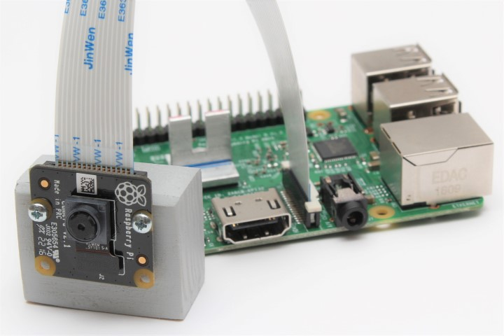

# Pi Camera Telegram Bot

Just a simple Telegram Bot, which takes pictures with the [Camera Module V2](https://www.raspberrypi.org/products/camera-module-v2/) and sends them to you




## How to start

First talk to the [@BotFather](https://telegram.me/BotFather) to get a token.

Make that token available as environment variable

```bash
export TELEGRAM_PICAM_BOT_TOKEN="<your_token>"
```

## Precompiled

Grab the jar:

```bash
wget https://github.com/Cir0X/PiCamBot/releases/download/1.0-SNAPSHOT/PiCamBot-1.0-SNAPSHOT-all.jar
```

and then execute it with:

```bash
java -jar PiCamBot-1.0-SNAPSHOT-all.jar
```


## Compile it yourself

Clone the repo and run it with

```bash
./gradlew run
```

or create a Shadow jar

```bash
./gradlew shadowJar
# => build/libs/PiCamBot-1.0-SNAPSHOT-all.jar
```

Tested on a Pi3 with the NoIR Camera Module V2

## Acknowledgments

* [Telegram Bot API](https://core.telegram.org/api)
* [Telegram Bot Java Library](https://github.com/rubenlagus/TelegramBots)
* [JRPiCam](https://github.com/Hopding/JRPiCam)
* [Shadow](https://github.com/johnrengelman/shadow)